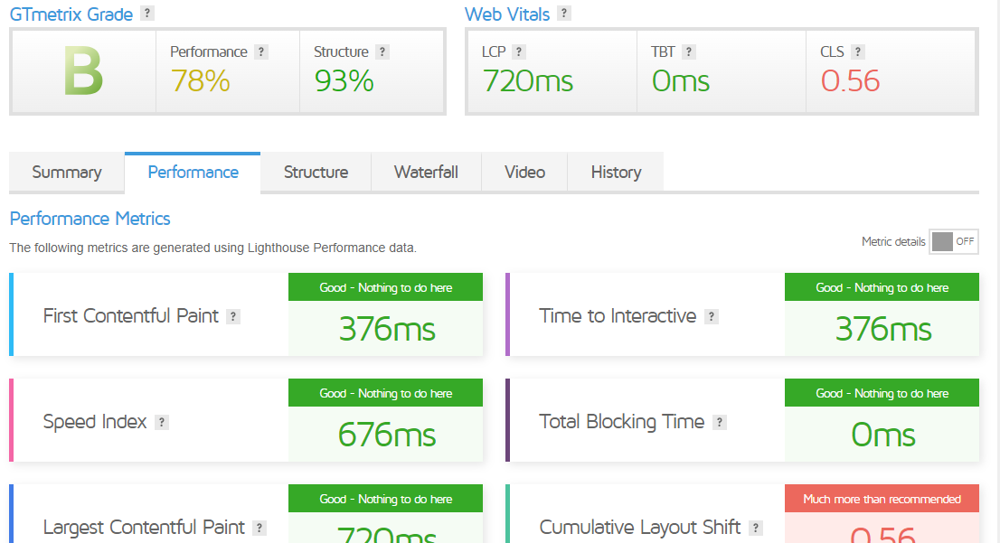

## Lumi Pampers Website

This repository contains the code for the Lumi Pampers website. The live site is hosted on [https://lumipampers.netlify.app/](https://lumipampers.netlify.app/).

### Background

The final design of the website was based on image files rather than the Figma designs. This decision was made because there were discrepancies between the two, but all the assets required for the image designs were available. Therefore, it was decided to use the available assets from the image designs instead.

### Sample Look


### Usage

To run the project locally, follow these steps:

1. Clone the repository:

   ```
   git clone https://github.com/Stoichiometrical/Lumi-RAPP-Challenge.git

2.Navigate to the project directory:
    ```
         cd Lumi-RAPP-Challenge```

3.Install dependencies:
    ```
    npm install```

4.Start the development server:
    ```
     npm run dev```

5.Open your browser and visit http://localhost:5173 to view the website.


### Performance After Optimization



### Technologies Used
Tailwind CSS for styling
Vite for creating the React app


### Hosting
The website was hosted on Netlify.


  